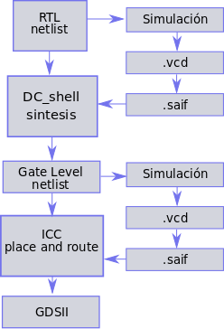
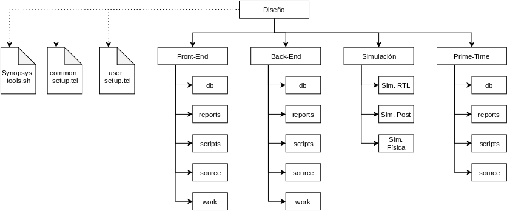
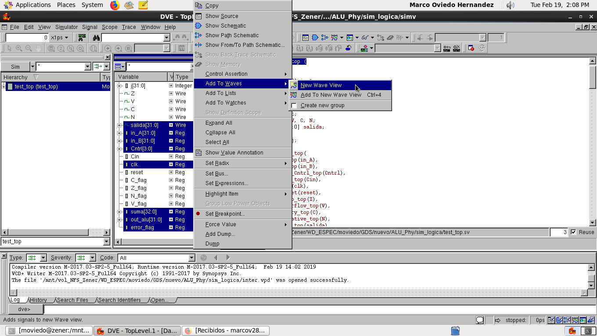
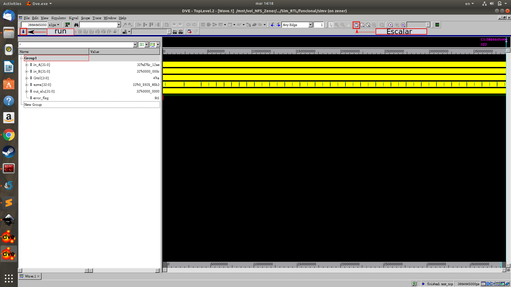

# Flujo para la Generanción de un SoC con las herramientas y Bibliotecas de Synopsys.
## Introducción
En el presente git se pretende enseñar y proveer los scripts necesarios para tormar un diseño en RTL y llevarlo hasta su sintesís física utilizando las bibliotecas de 180 nm de XFAB.  Se proveé a modo de ejemplo el código RTL de una ALU a la cual se le aplicara todos los procesos necesarios para converger su síntesis física.  


## Flujo
El flujo inicia usando como entrada el código verilog que describe el RTL. Inicialmente se verifica su funcionamiento y luego se corre una simulación especial para extraer un archivo saif. Estos tipos de archivos contienen la información de switching para hacer una estimación de potencia de un diseño bajo las condiciones expuestas en la simulación. Ambos archivos (RTL y saif) se utilizan en la herramienta **Design Compiler** para ejecutar la síntesis y obtener un archivo verilog a nivel de compuertas con una primera estimación de consumo. Para la síntesis física se corre un proceso similar con la diferencia que se utiliza como entrada el verilog a nivel de compuertas y el archivo saif de su simulación. Al final de todo este flujo se quiere obtener un archivo GDSII que utiliza el fabricante para la construcción del chip. El flujo utilizado se muestra en la próxima imagen.
<p align="center">
  
</p>

## Jerarquía de Carpetas
Con el fin de mantener todos los archivos ordenados y una localización estandarizada para los scripts se utiliza la siguiente jerarquía de carpetas:

* **Front_end:** En esta carpeta se encuentran todos los archivos fuente, scipts y carpetas necesarias para la sintesis a nivel de compuertas apartir del RTL especificado. Se compone de las siguientes carpetas :
  * **Source:** En ella estan todos los archivos que sirven de entrada para la síntesis del RTL. (Código verilog y Saif de la simulación). Aquí también se guarda el netlist de salida con la información de las compuertas.
  * **scripts:** En esta carpeta estan guardados todos los scripts utilizados para la síntesis lógica.
  * **reports:** Aquí se guardan los reportes generados por el **Design Compiler**.
  * **db:** En ella se guardan los archivos resultantes, que no son reportes, de la síntesis lógica.
  * **work:** En esta carptera se guardan los archivos temporales durante la ejecución de los scripts.
* **Back_end:** En esta carpeta se encuentra todos los archivos necesarios para la ejecución de la síntesis física. Su estructura es igual a la de front_end con la diferencia que su objetivo es la síntesis física.
* **Prime_time:**
* **Simulación:**
  * **Simulación RTL:** Dentro de ella se realizan las simulaciones funcionales del RTL y las simulacion usada para generar el saif correspondiente. Existe una carpeta destinada para cada tipo de test.
  * **Simulación post-síntesis:** Dentro de ella se realizan las simulaciones funcionales del netlist a nivel de compuertas y las simulacion usada para generar el saif correspondiente. Existe una carpeta destinada para cada tipo de test. 
  * **Simulación física:** Dentro de ella se realizan las simulaciones funcionales del netlist a nivel físico.
<p align="center">
  
</p>

# Descarga Git
Para descargar este repositorio se utiliza la intrucción ``git clone`` desde la terminal ubicada en el sitio de trabajo. Existen dos formas de usar esta instrucción que son utilizando la dirección https o la dirección ssh. Usualmente se usa la https, pero debido a que centos tiene un problema con ella se usará la ssh. 
```
git clone git@github.com:esolera/Flujo_Diseno_Digital.git
```
En caso de que también falle la ssh, se puede descargar el zip desde la pagina de github. Finlizada la clonación es necesario entrar en el repositorio para continuar con el tutorial.
# Simulación de RTL
Lo primero que debe hacerse antes de las simulaciones es haber seteado las direcciones de las herramientas atraves de variables, para ello esta el script **synopsys_tools.sh**. Este script se encuentra en el directorio principal.
```
source synopsys_tools.sh
```
## Simulación Funcional
Antes de iniciar cualquier síntesis es necesario haber verificado que RTL no contenga errores (Esto siempre es un paso fundamental). Para ellos se destino un espacio de trabajo en ```Simulaciones/Sim_RTL/funcional/```. En el caso de la alu se tiene dentro de esta carpeta un test y un archivo file_list. Se utiliza la herramienta vcs para realizar simulaciones sobre el file_list el cual llama a todos los archivos verilog incluyendo al diseño y al test. Para ejecutar la simulación solo se debe ejecutar los siguientes comandos:
```
vcs -sverilog -debug_access+all -R -full64 -gui -f file_list
```
 Es importante denotar que el file_list debe verse así donde por último se llama al test:
```
../../../front_end/source/top.sv
../../../front_end/source/ALU_2.sv
../../../front_end/source/Barrel_Shifter.sv
../../../front_end/source/csk_bloque.sv
../../../front_end/source/CSK_sin_mux.sv
test_top.sv
```
Después de su ejecución se abrira una interfaz gráfica con toda la información del diseño y el test. Para iniciar la simulación primero debe seleccionarse las ondas que desean verse como se muestra en la figura. 

<p align="center">
  
</p>
Esto abrira una ventana en la cual se debera apretar el boton de run que se muestra en la próxima imagen para ejecutar la simulación. Para tener una mejor visualización de todas las ondas hay que apretar el boton de escalado, si durante todo el tiempo la bandera de error se mantuvo en alto significa que el diseño aprobo la prueba.

<p align="center">
  
</p>

## Simulación SAIF
Antes de realizar la síntesis es necesario generar el archivo saif del RTL. Para ello se ha destinado una carpeta en ``Simulaciones/Sim_RTL/SAIF_test`` al cual hay que dirigirse en este momento. Una vez allí encontran un archivo de test y un make file, el make file ejecutara el test de tal manera que terminara guardando un archivo .vcd. Los archivos vcd tienen la información de la ondas de cada uno de los nodos del diseño y son usualmente usado para herramientas de visualización de ondas como vcs o gtkwave. Este archivo vcd lo tomara el make file para convertirlo en el saif bsucado, un archivo saif tiene la información switching de las señales la cual es usada para la estimación de potencia dinámica. En esta parte solo deben ejecutar :
```
make
```
Su ejecución tardará un par de segundos y una ves finalizado deben revisar que haya guardado el archivo alu.saif dentro de la carpeta source en front_end(```Flujo_Diseno_Digital/front_end/source```).
# Síntesis Lógica
En esta sección  se enseñara como tomar un diseño RTL y sintetizarlo a nivel de compuertas con las herramientas **Design Compiler**. Se utilizará a modo de ejemplo una ALU diseñada en el laboratorio DCILAB. 

Ahora deben dirigirse a la carpeta front_end y abrir todo el contenido que hay en scripts con algun editor de texto, en este caso se usara sublime text. Para realizar esto ejecute los siguientes comandos:
```
cd front_end
subl scripts/*
```
Todos los scripts se han desplegado en su pantalla, y debe dirigirse al llamado **run_all.tcl**. Este programa es usado para llamar a todos los scripts y ejecutar la síntesis en un solo comando. Hay 2 scripts que se llaman y no estan dentro de la carpeta scripts:
* **el user_setup.tcl**: Instancia una serie de variables con nombres y direcciones que las herramientas necesitan para encontrar y guardar archivos en su lugar correspondiente.
* **common_setup.tcl:** Inicia agregando unas direcciones en el search path para que las herramientas encuentren la información de la tecnología que necesitan para la sintesís.

Ambos estan ubicados en la carpeta principal por que son usados por todas las herramientas para setear el ambien de diseño.
Ahora se abrirá la herramienta **Design Compiler** desde la carpeta front_end utilizando la siguiente instrucción:
```
dc_shell -topo
```
Con esta herramienta no se usara la interfaz gráfica. Se iniciara ejecutando las 3 primeras líneas del **run_all.tcl** sobre la consola.
```
set PROY_HOME "../../Flujo_Diseno_Digital";
source $PROY_HOME/common_setup.tcl;
source $PROY_HOME/user_setup.tcl;
```
Si no hubo ningun error se puede continuar con el script **dc_setup.tcl** el cual busca la licencias y configura la herramienta  **Design Compiler** para comenzar a trabajar.
```
source ./scripts/dc_setup.tcl;
```
## Script: Analyze_rtl.tcl
El script siguiente analyze_rtl.tcl se correra instrucción por instrucción de manera didáctica. El primer comando esta relacionado al hecho de si se esta usando **Design Compiler** con modo topográfico o no. Este modo es usado cuando se quiere conseguir una mayor precisión en las estimaciones de potencia ya que ejecuta un pequeño pre-layout para su cálculo. Cuando se usa este modo es necesario tener en la carpeta de libs un archivo milkywave(alu.mw). El primer comando verifica la existencia de este archivo y en caso de que no este él lo crea. Ejecute el comando a continuación para realizar dicha acción:
```
if {[shell_is_in_topographical_mode]} {
	source -echo -verbose "$PROY_HOME_SYN/scripts/crear_mw.tcl";
	saif_map -start; 	
}
```
Ahora se ejecutaran 3 comandos : el primero carga todos los archivos verilog a la herramienta, el segundo  analiza el archivo top para ver si hay problemas de dependecias o sintaxis y el último construye el diseño que se le indique. 
```
read_file -format sverilog {$PROY_HOME_SYN/source/top.sv $PROY_HOME_SYN/source/ALU_2.sv $PROY_HOME_SYN/source/Barrel_Shifter.sv $PROY_HOME_SYN/source/csk_bloque.sv $PROY_HOME_SYN/source/CSK_sin_mux.sv};
elaborate $TOP_MODULE -architecture verilog -library WORK > reports/elaborate.txt;
```
El último comando del script le índica a la herramienta como usar los metales, en el sentido de cuales usar para conexiones verticales y horizontales en la construcción del pre-layout creado en el modo topográfico.
```
if {[shell_is_in_topographical_mode]} {
set_preferred_routing_direction -layers {MET1 MET3 METTP} -direction horizontal;
set_preferred_routing_direction -layers {MET2 MET4 METTPL} -direction vertical;
}
```
## Script: dc_setup.tcl

Este scrip es el encargado para ejecutar la sintesis de los archivos. Al igual que el anterior se correra instrucción por intrucción de manera didactica. Se inicia linkeando los archivos verilog, viendo que todas las referencias se cumplan y que no hagan falta ninguno. También se hace un checkeo con el segundo comando, revisando que no exista ningun problema en los diseños despues de relacionarlos.
```
link > reports/link.txt;
check_design > reports/check_dsgn.txt;
```
Ahora se guardara el diseño linkeado antes de la compilación en formato ddc en la carptera db.
```
write -hierarchy -format ddc -output "$PROY_HOME_SYN/db/$DESIGN_NAME\_pre_compile.ddc";
```
Antes de hacer la compilación debemos decirle a la herramienta que restricciones tiene al momento de ejecutar el diseño. De esta manera uno puede guiar a la herramienta a una solución especifica de velocidad, potencia y area. El primer comando instancia las restricciones y el segundo las propaga por la herramienta.
```
source -verbose -echo "$PROY_HOME_SYN/scripts/$DESIGN_NAME\_constraints.tcl";
propagate_constraints;
```
El último paso antes de la compilación es que si se quiere obtener estimaciones de consumo es necesario informacelo a la herramienta por medio del siguiente paso.
```
if {[shell_is_in_topographical_mode]} {
	set_power_prediction; 		
} else {
	propagate_switching_activity; 
}
```
Ahora se ejecuta el esperado paso de la compilación con el siguiente comando:
```
compile_ultra -no_autoungroup -exact_map > reports/compile.txt; 
```
Una vez terminada y con el diseño de compuertas a mano, es momento de hacer la estimación del consumo por medio del archivo saif. El siguiente comando lee la instancia dentro del saif indicada con la información del switching, como la simulación del RTL solo tiene los nodos de entrada y salida con la bandera -auto_mapnames se propagan estos factores de switching por el resto del diseño. El comando es el siguiente: 
```
if {[shell_is_in_topographical_mode]} {
	read_saif -input "$PROY_HOME/front_end/source/$DESIGN_NAME.saif" \
 -instance_name $TEST_INST_NAME/inst_top -auto_map_names;
}
```
Ahora si el diseño tiene compuertas tri estado definidas con el comando tri es necesario pasarla a wire. También es necesario nombrar los puertos para el archivo verilog del diseño generado.Los siguientes comandos haran estos 2 trabajos:
```
set verilogout_no_tri true
change_names -hierarchy -rules verilog 
```
Ahora generamos todos los reportes de potencia, area, timing, etc.
```
report_power -analysis_effort high > "$PROY_HOME_SYN/reports/$DESIGN_NAME\_syn_power.txt";
report_area >  "$PROY_HOME_SYN/reports/$DESIGN_NAME\_syn_area.txt";
report_qor > "$PROY_HOME_SYN/reports/$DESIGN_NAME\_syn_qor.txt";
report_timing > "$PROY_HOME_SYN/reports/$DESIGN_NAME\_syn_timing.txt";
report_port > "$PROY_HOME_SYN/reports/$DESIGN_NAME\_syn_port.txt";
```
Por ultimo se guardan los archivos de salida del diseño.
```
write -hierarchy -format ddc -output "$TOP_FILE_DDC";
write -format verilog -hierarchy -output "$TOP_FILE_SYN";
write_sdc "$TOP_FILE_SDC";
write_sdf "$TOP_FILE_SDF";
puts "RM-Info: Completed script [info script]\n";
```
