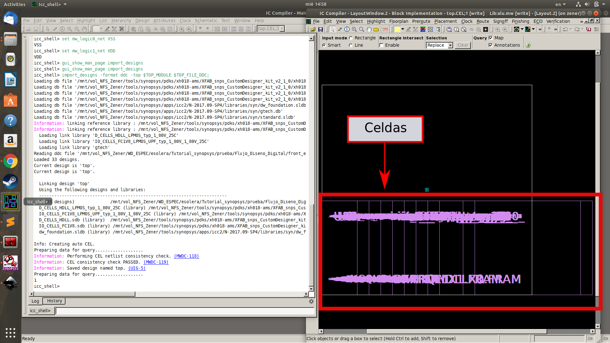

# Flujo para la Generanción de un SoC con las herramientas y Bibliotecas de Synopsys.
## Introducción
En el presente git se pretende enseñar y proveer los scripts necesarios para tormar un diseño en RTL y llevarlo hasta su sintesís física utilizando las bibliotecas de 180 nm de XFAB.  Se proveé a modo de ejemplo el código RTL de una ALU a la cual se le aplicara todos los procesos necesarios para converger su síntesis física.  


## Flujo
El flujo inicia usando como entrada el código verilog que describe el RTL. Inicialmente se verifica su funcionamiento y luego se corre una simulación especial para extraer un archivo saif. Estos tipos de archivos contienen la información de switching para hacer una estimación de potencia de un diseño bajo las condiciones expuestas en la simulación. Ambos archivos (RTL y saif) se utilizan en la herramienta **Design Compiler** para ejecutar la síntesis y obtener un archivo verilog a nivel de compuertas con una primera estimación de consumo. Para la síntesis física se corre un proceso similar con la diferencia que se utiliza como entrada el verilog a nivel de compuertas y el archivo saif de su simulación. Al final de todo este flujo se quiere obtener un archivo GDSII que utiliza el fabricante para la construcción del chip. El flujo utilizado se muestra en la próxima imagen.
<p align="center">
  
</p>

## Jerarquía de Carpetas
Con el fin de mantener todos los archivos ordenados y una localización estandarizada para los scripts se utiliza la siguiente jerarquía de carpetas:

* **Front_end:** En esta carpeta se encuentran todos los archivos fuente, scipts y carpetas necesarias para la sintesis a nivel de compuertas apartir del RTL especificado. Se compone de las siguientes carpetas :
  * **Source:** En ella estan todos los archivos que sirven de entrada para la síntesis del RTL. (Código verilog y Saif de la simulación). Aquí también se guarda el netlist de salida con la información de las compuertas.
  * **scripts:** En esta carpeta estan guardados todos los scripts utilizados para la síntesis lógica.
  * **reports:** Aquí se guardan los reportes generados por el **Design Compiler**.
  * **db:** En ella se guardan los archivos resultantes, que no son reportes, de la síntesis lógica.
  * **work:** En esta carptera se guardan los archivos temporales durante la ejecución de los scripts.
* **Back_end:** En esta carpeta se encuentra todos los archivos necesarios para la ejecución de la síntesis física. Su estructura es igual a la de front_end con la diferencia que su objetivo es la síntesis física.
* **Prime_time:**
* **Simulación:**
  * **Simulación RTL:** Dentro de ella se realizan las simulaciones funcionales del RTL y las simulacion usada para generar el saif correspondiente. Existe una carpeta destinada para cada tipo de test.
  * **Simulación post-síntesis:** Dentro de ella se realizan las simulaciones funcionales del netlist a nivel de compuertas y las simulacion usada para generar el saif correspondiente. Existe una carpeta destinada para cada tipo de test. 
  * **Simulación física:** Dentro de ella se realizan las simulaciones funcionales del netlist a nivel físico.
<p align="center">
  
</p>

# Descarga Git
Para descargar este repositorio se utiliza la intrucción ``git clone`` desde la terminal ubicada en el sitio de trabajo. Existen dos formas de usar esta instrucción que son utilizando la dirección https o la dirección ssh. Usualmente se usa la https, pero debido a que centos tiene un problema con ella se usará la ssh. 
```
git clone git@github.com:esolera/Flujo_Diseno_Digital.git
```
En caso de que también falle la ssh, se puede descargar el zip desde la pagina de github. Finlizada la clonación es necesario entrar en el repositorio para continuar con el tutorial.
# Simulación de RTL
Lo primero que debe hacerse antes de las simulaciones es haber seteado las direcciones de las herramientas atraves de variables, para ello esta el script **synopsys_tools.sh**. Este script se encuentra en el directorio principal.
```
source synopsys_tools.sh
```
## Simulación Funcional
Antes de iniciar cualquier síntesis es necesario haber verificado que RTL no contenga errores (Esto siempre es un paso fundamental). Para ellos se destino un espacio de trabajo en ```Simulaciones/Sim_RTL/funcional/```. En el caso de la alu se tiene dentro de esta carpeta un test y un archivo file_list. Se utiliza la herramienta vcs para realizar simulaciones sobre el file_list el cual llama a todos los archivos verilog incluyendo al diseño y al test. Para ejecutar la simulación solo se debe ejecutar los siguientes comandos:
```
vcs -sverilog -debug_access+all -R -full64 -gui -f file_list
```
 Es importante denotar que el file_list debe verse así donde por último se llama al test:
```
../../../front_end/source/top.sv
../../../front_end/source/ALU_2.sv
../../../front_end/source/Barrel_Shifter.sv
../../../front_end/source/csk_bloque.sv
../../../front_end/source/CSK_sin_mux.sv
test_top.sv
```
Después de su ejecución se abrira una interfaz gráfica con toda la información del diseño y el test. Para iniciar la simulación primero debe seleccionarse las ondas que desean verse como se muestra en la figura. 

<p align="center">
  
</p>
Esto abrira una ventana en la cual se debera apretar el boton de run que se muestra en la próxima imagen para ejecutar la simulación. Para tener una mejor visualización de todas las ondas hay que apretar el boton de escalado, si durante todo el tiempo la bandera de error se mantuvo en alto significa que el diseño aprobo la prueba.

<p align="center">
  
</p>

## Simulación SAIF
Antes de realizar la síntesis es necesario generar el archivo saif del RTL. Para ello se ha destinado una carpeta en ``Simulaciones/Sim_RTL/SAIF_test`` al cual hay que dirigirse en este momento. Una vez allí encontran un archivo de test y un make file, el make file ejecutara el test de tal manera que terminara guardando un archivo .vcd. Los archivos vcd tienen la información de la ondas de cada uno de los nodos del diseño y son usualmente usado para herramientas de visualización de ondas como vcs o gtkwave. Este archivo vcd lo tomara el make file para convertirlo en el saif bsucado, un archivo saif tiene la información switching de las señales la cual es usada para la estimación de potencia dinámica. En esta parte solo deben ejecutar :
```
make
```
Su ejecución tardará un par de segundos y una ves finalizado deben revisar que haya guardado el archivo alu.saif dentro de la carpeta source en front_end(```Flujo_Diseno_Digital/front_end/source```).
# Síntesis Lógica
En esta sección  se enseñara como tomar un diseño RTL y sintetizarlo a nivel de compuertas con las herramientas **Design Compiler**. Se utilizará a modo de ejemplo una ALU diseñada en el laboratorio DCILAB. 

Ahora deben dirigirse a la carpeta front_end y abrir todo el contenido que hay en scripts con algun editor de texto, en este caso se usara sublime text. Para realizar esto ejecute los siguientes comandos:
```
cd front_end
subl scripts/*
```
Todos los scripts se han desplegado en su pantalla, y debe dirigirse al llamado **run_all.tcl**. Este programa es usado para llamar a todos los scripts y ejecutar la síntesis en un solo comando. Hay 2 scripts que se llaman y no estan dentro de la carpeta scripts:
* **el user_setup.tcl**: Instancia una serie de variables con nombres y direcciones que las herramientas necesitan para encontrar y guardar archivos en su lugar correspondiente.
* **common_setup.tcl:** Inicia agregando unas direcciones en el search path para que las herramientas encuentren la información de la tecnología que necesitan para la sintesís.

Ambos estan ubicados en la carpeta principal por que son usados por todas las herramientas para setear el ambien de diseño.
Ahora se abrirá la herramienta **Design Compiler** desde la carpeta front_end utilizando la siguiente instrucción:
```
dc_shell -topo
```
Con esta herramienta no se usara la interfaz gráfica. Se iniciara ejecutando las 3 primeras líneas del **run_all.tcl** sobre la consola.
```
set PROY_HOME "../../Flujo_Diseno_Digital";
source $PROY_HOME/common_setup.tcl;
source $PROY_HOME/user_setup.tcl;
```
Si no hubo ningun error se puede continuar con el script **dc_setup.tcl** el cual busca la licencias y configura la herramienta  **Design Compiler** para comenzar a trabajar.
```
source ./scripts/dc_setup.tcl;
```
## Script: Analyze_rtl.tcl
El script siguiente analyze_rtl.tcl se correra instrucción por instrucción de manera didáctica. El primer comando esta relacionado al hecho de si se esta usando **Design Compiler** con modo topográfico o no. Este modo es usado cuando se quiere conseguir una mayor precisión en las estimaciones de potencia ya que ejecuta un pequeño pre-layout para su cálculo. Cuando se usa este modo es necesario tener en la carpeta de libs un archivo milkywave(alu.mw). El primer comando verifica la existencia de este archivo y en caso de que no este él lo crea. Ejecute el comando a continuación para realizar dicha acción:
```
if {[shell_is_in_topographical_mode]} {
	source -echo -verbose "$PROY_HOME_SYN/scripts/crear_mw.tcl";
	saif_map -start; 	
}
```
Ahora se ejecutaran 3 comandos : el primero carga todos los archivos verilog a la herramienta, el segundo  analiza el archivo top para ver si hay problemas de dependecias o sintaxis y el último construye el diseño que se le indique. 
```
read_file -format sverilog "$PROY_HOME_SYN/source/top.sv $PROY_HOME_SYN/source/ALU_2.sv $PROY_HOME_SYN/source/Barrel_Shifter.sv $PROY_HOME_SYN/source/csk_bloque.sv $PROY_HOME_SYN/source/CSK_sin_mux.sv";
analyze -library WORK -format sverilog $TOP_FILE > reports/analyze.txt;
elaborate $TOP_MODULE -architecture verilog -library WORK > reports/elaborate.txt;
```
El último comando del script le índica a la herramienta como usar los metales, en el sentido de cuales usar para conexiones verticales y horizontales en la construcción del pre-layout creado en el modo topográfico.
```
if {[shell_is_in_topographical_mode]} {
set_preferred_routing_direction -layers {MET1 MET3 METTP} -direction horizontal;
set_preferred_routing_direction -layers {MET2 MET4 METTPL} -direction vertical;
}
```
## Script: dc_syn.tcl

Este scrip es el encargado para ejecutar la síntesis de los archivos. Al igual que el anterior se correra instrucción por intrucción de manera didáctica. Se inicia enlazando los archivos verilog, viendo que todas las referencias se cumplan y que no hagan falta ninguno. También se hace una revisión con el segundo comando, revisando que no exista ningun problema en los diseños despues de relacionarlos.
```
link > reports/link.txt;
check_design > reports/check_dsgn.txt;
```
Ahora se guardara el diseño linkeado antes de la compilación en formato ddc en la carptera db.
```
write -hierarchy -format ddc -output "$PROY_HOME_SYN/db/$DESIGN_NAME\_pre_compile.ddc";
```
Antes de hacer la compilación debemos decirle a la herramienta que restricciones tiene al momento de ejecutar el diseño. De esta manera uno puede guiar a la herramienta a una solución especifica de velocidad, potencia y area. El primer comando instancia las restricciones y el segundo las propaga por la herramienta.
```
source -verbose -echo "$PROY_HOME_SYN/scripts/$DESIGN_NAME\_constraints.tcl";
propagate_constraints;
```
El último paso antes de la compilación es que si se quiere obtener estimaciones de consumo es necesario informacelo a la herramienta por medio del siguiente paso.
```
if {[shell_is_in_topographical_mode]} {
	set_power_prediction; 		
} else {
	propagate_switching_activity; 
}
```
Ahora se ejecuta el esperado paso de la compilación con el siguiente comando:
```
compile_ultra -no_autoungroup -exact_map > reports/compile.txt; 
```
Una vez terminada y con el diseño de compuertas a mano, es momento de hacer la estimación del consumo por medio del archivo saif. El siguiente comando lee la instancia dentro del saif indicada con la información del switching, como la simulación del RTL solo tiene los nodos de entrada y salida con la bandera -auto_mapnames se propagan estos factores de switching por el resto del diseño. El comando es el siguiente: 
```
if {[shell_is_in_topographical_mode]} {
	read_saif -input "$PROY_HOME/front_end/source/$DESIGN_NAME.saif" \
 -instance_name $TEST_INST_NAME/inst_top -auto_map_names;
}
```
Ahora si el diseño tiene compuertas tri estado definidas con el comando tri es necesario pasarla a wire. También es necesario nombrar los puertos para el archivo verilog del diseño generado.Los siguientes comandos haran estos 2 trabajos:
```
set verilogout_no_tri true
change_names -hierarchy -rules verilog 
```
Ahora generamos todos los reportes de potencia, area, timing, etc.
```
report_power -analysis_effort high > "$PROY_HOME_SYN/reports/$DESIGN_NAME\_syn_power.txt";
report_area >  "$PROY_HOME_SYN/reports/$DESIGN_NAME\_syn_area.txt";
report_qor > "$PROY_HOME_SYN/reports/$DESIGN_NAME\_syn_qor.txt";
report_timing > "$PROY_HOME_SYN/reports/$DESIGN_NAME\_syn_timing.txt";
report_port > "$PROY_HOME_SYN/reports/$DESIGN_NAME\_syn_port.txt";
```
Por ultimo se guardan los archivos de salida del diseño.
```
write -hierarchy -format ddc -output "$TOP_FILE_DDC";
write -format verilog -hierarchy -output "$TOP_FILE_SYN";
write_sdc "$TOP_FILE_SDC";
write_sdf "$TOP_FILE_SDF";
puts "RM-Info: Completed script [info script]\n";
```
Verifiqué que se guardo el netlist **alu_syn.v** en la carpeta source necesario para los pasos siguientes. 

# Simulación Post-Synthesys
## Funcional
Ahora verificaremos que el netlist generado funcione correctamente, los pasos son muy similares a los realizados en la simulación funcional de RTL. Hay que ubicarse en la carpeta ```Simulaciones/sim_postsyn_logic/Funcional/``` dentro de ella se observara un file__list y un test. Este file_list es ligeramente diferente pues inicia llamando las primitivas y celdas de XFAB usadas en la síntesis para ejecutar la simulación. También llama al verilog del netlist a nivel de compuertas y al test.
```
/mnt/vol_NFS_Zener/tools/synopsys/pdks/xh018-ams/XFAB_snps_CustomDesigner_kit_v2_1_0/xh018/diglibs/D_CELLS_HDLL/v2_1/verilog/v2_1_0/VLG_PRIMITIVES.v
/mnt/vol_NFS_Zener/tools/synopsys/pdks/xh018-ams/XFAB_snps_CustomDesigner_kit_v2_1_0/xh018/diglibs/D_CELLS_HDLL/v2_1/verilog/v2_1_0/D_CELLS_HDLL.v
../../../front_end/source/alu_syn.v
test_top.sv
```
Para ejecutar la simulación solo se debe ejecutar el mismo comando usado con anterioridad:
```
vcs -sverilog -debug_access+all -R -full64 -gui -f file_list
```
Dentro del cuadro rojo puede verse como ha cambiado el contenido del top, ya que ahora sus instancias estan cosntruidas con compuertas. Para poder verlo deben llevar la barra hasta la parte más baja.
<p align="center">
  
</p>

Ahora se abrirá un visualizador de ondas con las misma señales que en la simulación pasada y se ejecutara para revisar si el diseño funcionamente sifue funcionando. En la próxima imagen puede observar como el diseño de la alu sigue funcionando.(Recuerden fijarse en la bandera de error sigue en alto indicando que todo esta bien).

<p align="center">
  
</p>

## Generación del archivo saif para sintésis física

Ahora para generar el saif para la sintésis física debe dirigirse a la carpeta ```Simulaciones/sim_postsyn_logic/SAIF_test/``` en la cual solo debera ejecutar el comando :

```
make
```
Una vez terminado verifiqué que en la carpeta source del back_end se halla guardado el archivo alu.saif.

# Síntesis Física
Ahora se seguira con la Sintésis física en donde se genera el layout del netlist generado en los pasos anteriores. Debe dirigirse a la carpeta ```Flujo_Diseno_Digital/back_end``` en donde abrirá todos los archivos presentes en la capeta scripts.
```
subl scripts/*
```
Ahora se abrira la herramienta **Integrated Circuit Compiler(ICC)** que es una herramienta de synopsys la cual ejecuta la sintesis física del circuito. Para abrirla se debe correr el próximo comando desde la carpeta ```back_end```:

```
icc_shell -gui
```

Ahora se abrira una interfáz grafica como la que se muestran en la siguiente figura. Los comando que seguiran a continuación se correran desde el *shell* de esta interfaz.

<p align="center">
  
</p>

## Scripts de inicialización del ambiente

Se iniciaran corriendo los 2 scripts que se habían usado en la síntesis lógica: **common_setup.tcl** y **user_setup.tcl**. Posterior a ellos se correra un script especial para **ICC** el cual setea varaibles y licencia que necesita. El ambiente se inicializa corriendo estos 3 scripts con los siguientes comandos:

```
set PROY_HOME "../../Flujo_Diseno_Digital";
source $PROY_HOME/common_setup.tcl;
source $PROY_HOME/user_setup.tcl;
source ./scripts/icc_setup.tcl;
```
Si todo a salido bien la inicialización de la herramienta esta terminada para comenzar a operar.

## Script: alu_phy_opt.tcl

Este script se correra paso a paso de manera didactica . El mismo inicia limpiando la aplicación de diseños anteriores, no siempre se necesita este comando pero es bueno asegurarse para evitar problemas.

```
remove_design -designs
```

Es necesario verificar que en la carpeta lib de back_end exista una carpeta milkywave(alu.mw), en caso de que no exista hay que crearla. Para ello se corre el próximo comando:

```
source -echo -verbose "$PROY_HOME_PHY/scripts/crear_mw.tcl"
```

Ahora le informa a la herramienta que se va hacer una estimación de potencia por medio de un archivo saif para que prepare los mapeos al subir el netlist. Para ello ejecute el próximo comando:

```
saif_map -start 
```

Ahora se nombra las varaibles que representan los voltajes de alimentación.

```
set mw_logic0_net VSS
set mw_logic1_net VDD
```

El próximo comando importa el netlist resultante de la síntesis lógica con **DC_compiler**, especificamente importa *alu.ddc* que se encuentra en la carpeta db de front_end. Como resultado de su ejecución debe abrirse otra ventana con el espacio de trabajo para el layout, en donde se encontraran instanciadas de una vez todas las celdas.

```
import_designs -format ddc -top $TOP_MODULE $TOP_FILE_DDC;
```

<p align="center">
  
</p>

Ahora se remueve la multiples jerarquías de las celdas usadas , para sustituirla por una sola. Después de esto se utiliza el comando link para enlazar todas las instancias.

```
uniquify_fp_mw_cel 
link -force
```
El siguiente comando especifica los nombres de las fuentes de poder como Vdd y tierra.

```
derive_pg_connection -power_net VDD -power_pin vdd -ground_net VSS -ground_pin gnd
derive_pg_connection -power_net "VDD" -ground_net "VSS" -tie
```
Ahora se van a leer las restricciones con las que trabajara la herramienta de synopsys.
```
read_sdc -version Latest $TOP_FILE_SDC; 
```

El primer comando define el mallado mínimo del espacio de trabajo, para indicarselo se utiliza la técnologia que en este caso es *hdll* (high density low leakage). El segundo comando activa las optimizaciones al momento del colocado de las celdas para el timing.

```
set_fp_strategy -unit_tile_name "hdll";
set_fp_placement_strategy -virtual_IPO on
```

El próximo comando genera el floorplan indicandoles sus dimensiones y área de core. En la próxima imagen se puede ver el resultado  al generar el floorplan, donde el cuadrado de color celeste son los pads del chip, la celdas son ordenadas afuera como en una fila y el cuadrado pequeño interno es donde se el permite a la herramienta colocar las celdas.

```
create_floorplan -core_utilization 0.7 -left_io2core 30 -bottom_io2core 30 -right_io2core 30 -top_io2core 30;
```

<p align="center">
  
</p>

El próximo comando coloca las celdas en el area permitida indicandole que no lo haga de manera jerárquica y optimizando para timing. En la imagen se observa como todas las celdas se colocaron en el cuadrado interno.

```
create_fp_placement -timing_driven -no_hier;
```

<p align="center">
  
</p>

El primer comando siguiente hace un estudio de posibles áreas de congestión dentro del chip debido a la colocación de sus celdas y con base en esto las reordena para eliminar estos puntos. El segundo le confirma a la herramienta que este va ser el ordenamiento usado.

```
refine_placement -congestion_effort low;
legalize_placement;
```
En la siguiente parte por motivos de seguridad se guarda el diseño logrado hasta el momento.

```
save_mw_cel -as floorplan_ends;
copy_mw_cel -from  floorplan_ends -to floorplan_ends1;
close_mw_cel floorplan_ends;
close_mw_cel top;
open_mw_cel floorplan_ends1;
```
Ahora se vuelven a definir los dominios de voltaje, esto se hace varias veces por motivos de seguridad ya que en algun proceso la herramienta puede perder estas referencias.
```
derive_pg_connection -power_net VDD -power_pin vdd -ground_net VSS -ground_pin gnd
derive_pg_connection -power_net VDD -power_pin vdd -ground_net VSS -ground_pin gnd -tie
```
El próximo comando lo que hace es setear una variable de **IC Compiler** que define el orden en que se hacen los straps. Los straps son las líneas de vdd y tierra en donde se colocan las celdas para su alimentación. Por default la herramienta inicia contruyendolos en capas de metal más externas hacia las más bajas, pero en algunos casos como este es necesario hacerlo de manera inversa. Para ellos solo seteamos en true esta variable.

```
set pns_commit_lower_layer_first true
```
En los próximos comandos le define las restricciones que tiene la herramienta para generar el mallado de alimentacion. Como la distancias entre los straps, lo metales que usara para horizontales y verticales etc.

```
set_fp_rail_constraints -add_layer  -layer METTP -direction horizontal -max_strap 16 -min_strap 4 -min_width 2 -spacing 12
set_fp_rail_constraints -add_layer  -layer METTPL -direction vertical  -max_strap 16 -min_strap 4 -min_width 2 -spacing 12 
set_fp_rail_constraints  -set_ring -horizontal_ring_layer { METTP  } -vertical_ring_layer { METTPL } -extend_strap core_ring
set_fp_rail_constraints -set_global   -no_routing_over_hard_macros -no_routing_over_soft_macros
```

El siguiente comando invoca unas herramientas de **IC Compiler** que evitan las violaciones de straps. 
```
set_pnet_options -partial {METTP METTPL}
```

Este comando alínea los straps de vdd y ground con los rieles de la celda en nivel más bajo de metal. 
El comando trata de evitar que un strap de vdd caiga sobre un riel de ground de alguna celda o viceversa.

```
set_fp_rail_strategy -align_strap_with_m1_rail true; 
```
El primer comando crea los power nets con todas las restricciones seleccionados. El mismo comando le da a la herramienta restricciones de consumo y las nets que sintetizará. En la imagen se observan los straps creados para las celdas. El segundo comando da la confirmación a la herramienta de que se usara esta distribución de alimentación. Las imagenes que se muestran a continuación son las cosas que se deberían ver en el espacio de trabajo conforme se ejecutan los comandos.

```
synthesize_fp_rail  -nets { VDD VSS } -voltage_supply 1.8 -synthesize_power_plan -power_budget 1000 -pad_masters { VDD VSS } -use_pins_as_pads -use_strap_ends_as_pads 
commit_fp_rail
```
<p align="center">
  
</p>

<p align="center">
  
</p>

El primero de estos 3 comandos mueve las vias al centro de las interconexiones de las alimentación hacia el centro,
Los otros dos comandos conetan las celdas a los anillos y straps de alimentacion. En la imagen se observa como las vias que se colocaron quedaron centrados en el metal y como se conectaron las celdas con un metal de color gris.
```
set_preroute_advanced_via_rule -move_via_to_center
preroute_standard_cells -nets VDD -fill_empty_rows -remove_floating_pieces -connect both -extend_to_boundaries_and_generate_pins
preroute_standard_cells -nets VSS -fill_empty_rows -remove_floating_pieces -connect both -extend_to_boundaries_and_generate_pins
```

<p align="center">
  
</p>

Al momento de hacer los ruteos de la alimentación la herramienta pudo haber movido algunas celdas de donde estaban. Por lo cual se vuelven a correr los comando de colocación y reordenamiento.

```
create_fp_placement -timing_driven -no_hierarchy_gravity -incremental all;
refine_placement -congestion_effort high;
legalize_fp_placement;
```
Se vuelven a ejecutar los comandos de ruteo, pero con las banderas de que revise si alguna celda no quedo conectada para que la conecte y que remueva aquellas secciones de metal que no conectan a ninguna celda.

```
preroute_standard_cells -nets VDD -fill_empty_rows -remove_floating_pieces -connect both; 
preroute_standard_cells -nets VSS -fill_empty_rows -remove_floating_pieces -connect both; 
```
Ahora se vuelve a guardar y abrir el diseño para continuar con el ruteo entre las celdas.
```
set_preroute_advanced_via_rule
save_mw_cel -as powerplan_rail_ends
close_mw_cel floorplan_ends1
open_mw_cel powerplan_rail_ends
```

El primero de estos 3 comandos, crea un prefijo utilizado durante la compilación, el segundo hace un placemente, ruteo y optimización de manera simultanea. Y el último confirma el ordenamiento.
```
set compile_instance_name_prefix place
place_opt -effort high
legalize_placement -effort medium
```
Ahora se van a generar algunos reportes de interes, antes de continuar:
```
create_qor_snapshot -timing -constraint -congestion -name Place
report_qor_snapshot  > $PROY_HOME_PHY/reports/place.qor_snapshot.rpt
report_qor > $PROY_HOME_PHY/reports/place.qor
report_constraint -all > $PROY_HOME_PHY/reports/place.con
report_timing -capacitance -transition_time -input_pins -nets -delay_type max > $PROY_HOME_PHY/reports/place.max.tim
report_timing -capacitance -transition_time -input_pins -nets -delay_type min > $PROY_HOME_PHY/reports/place.min.tim
```
Ahora se ingresan las celdas de relleno para los espacios vacíos con el fin de dar estabilidad al circuito. Se redefinen los nombre de la fuente vdd y gnd. Y se revisa que ninguna celda este desconectada de vdd y tierra. Al final igual se vuelve a guardar el diseño generado. En la siguiente imagen se observa como quedaron agregadas las celdas de relleno.
```
insert_stdcell_filler  -cell_with_metal FEED25HDLL -connect_to_power VDD -connect_to_ground VSS
insert_stdcell_filler  -cell_with_metal FEED15HDLL  -connect_to_power VDD -connect_to_ground VSS
insert_stdcell_filler  -cell_with_metal FEED10HDLL  -connect_to_power VDD -connect_to_ground VSS
insert_stdcell_filler  -cell_with_metal FEED7HDLL  -connect_to_power VDD -connect_to_ground VSS
insert_stdcell_filler  -cell_with_metal  FEED5HDLL  -connect_to_power VDD -connect_to_ground VSS
insert_stdcell_filler  -cell_with_metal FEED3HDLL  -connect_to_power VDD -connect_to_ground VSS
insert_stdcell_filler  -cell_with_metal FEED2HDLL  -connect_to_power VDD -connect_to_ground VSS
insert_stdcell_filler  -cell_with_metal FEED1HDLL -connect_to_power VDD -connect_to_ground VSS
derive_pg_connection -power_net "VDD" -ground_net "VSS"
derive_pg_connection -power_net "VDD" -ground_net "VSS" -tie
preroute_standard_cells -nets VDD -fill_empty_rows -remove_floating_pieces -connect both;
preroute_standard_cells -nets VSS -fill_empty_rows -remove_floating_pieces -connect both;
save_mw_cel -as place_ends
close_mw_cel powerplan_rail_ends
open_mw_cel place_ends
```
<p align="center">
  
</p>
 
En esta parte se cargan las reglas de antena dando la dirección en donde se encuentra y inicializandolas en la herramienta.

```
source $TECH_ROOT/xh018/synopsys/v6_3/techMW/v6_3_1_1/xh018-synopsys-techMW-v6_3_1_1/xx018.ante.rules
report_antenna_rules
```
En esta parte se le da las opciones al enrutador(de nombre Zroute) para que pueda hacer su trabajo. Hace un primer ruteo y con él hace una estimacion de timing para hacer un reordenamiento optimizando este factor.
```
set_route_zrt_common_options -plan_group_aware all_routing
route_zrt_global -effort ultra
optimize_fp_timing
```

Ahora se le define unas nuevas opciones al enrutador.
```
set_route_zrt_common_options -default true
set_route_zrt_global_options -timing_driven true
set_route_zrt_global_options -effort high
set_route_zrt_track_options -timing_driven true
set_route_zrt_detail_options -drc_convergence_effort_level high
set_buffer_opt_strategy -effort low
set_route_zrt_detail_options -default_gate_size 0.1
```

El siguiente comando ejecutará la síntesis de arbol de reloj.
```
set_clock_tree_options -clock_trees clk -insert_boundary_cell true -ocv_clustering true -buffer_relocation true -buffer_sizing true -gate_relocation true -gate_sizing true
```

El primer y segundo comando habilitan a la herramienta a revisar el arbol de reloj generado. El tercero ejecuta el ruteo del reloj. Al final se hace un guardado del diseño

```
set cts_use_debug_mode true
set cts_do_characterization true
clock_opt -fix_hold_all_clocks
save_mw_cel -as clock_tree_placed
close_mw_cel place_ends
open_mw_cel clock_tree_placed
```
<p align="center">
  
</p>

El primer comando le dice a la herramienta que no toque el reloj ya generado para el diseño. Y los siguiente comandos hacen un proceso iterativo para conectar todas las celdas optimizando y liberando las congestiones. Por último
revisa las reglas de antena. En la imagen se puede observar como queda el diseño despues del ruteo.

```
set_dont_touch_network clk
route_zrt_auto -max_detail_route_iterations 40 ; #40
verify_zrt_route
psynopt -congestion
route_zrt_auto -max_detail_route_iterations 40; #40
route_opt -incremental
route_zrt_detail -incremental true -max_number_iterations 40; #40
focal_opt -drc_nets all
remove_zrt_redundant_shapes -report_changed_nets true
verify_zrt_route -antenna true
verify_zrt_route -antenna true  > "$PROY_HOME_PHY/reports/$DESIGN_NAME\_drc_route.txt"
verify_pg_nets > "$PROY_HOME_PHY/reports/$DESIGN_NAME\_pg_nets.txt"
verify_pg_nets -pad_pin_connection all > "$PROY_HOME_PHY/reports/$DESIGN_NAME\_pg_nets_pad_pin_connection.txt"
```
<p align="center">
  
</p>

Ya solo quedan los últimos pasos del diseño que son verificar las pruebas de DRC y LVS y por último hacer la extracción de parasitancias. Se guarda el diseño en un archivo verilog para realizarle pruebas.
```
write_verilog "$PROY_HOME_PHY/db/$DESIGN_NAME\_phy_sim.v"
```
Se realizan los pasos de seguridad en caso de que al rutear el diseño hubiera cambiado algo.
```
derive_pg_connection -power_net VDD -power_pin vdd -ground_net VSS -ground_pin gnd
derive_pg_connection -power_net VDD -power_pin vdd -ground_net VSS -ground_pin gnd -tie
set_preroute_drc_strategy -max_layer MET1
preroute_standard_cells -nets VDD -fill_empty_rows -remove_floating_pieces -connect both;
preroute_standard_cells -nets VSS -fill_empty_rows -remove_floating_pieces -connect both;
```
En esta parte se hace los rellenos de NWELL en aquellos lugares donde quedaron huecos que lo necesitan y el otro pone rellenos de metal a los metales que incumple con las reglas.
```
insert_well_filler -layer NWELL -higher_edge max -lower_edge min
insert_metal_filler -from_metal 2 -to_metal 6
```
Se vuelve a guardar el diseño
```
save_mw_cel -as routed_cell
close_mw_cel clock_tree_placed
open_mw_cel routed_cell
```
Se vuelven a colocar las celdas de relleno por si el ruteo removio alguna. Y a correr otros pasos ya ejecutados por motivos de seguridad.
```
insert_stdcell_filler  -cell_with_metal FEED25HDLL -connect_to_power VDD -connect_to_ground VSS
insert_stdcell_filler  -cell_with_metal FEED15HDLL  -connect_to_power VDD -connect_to_ground VSS
insert_stdcell_filler  -cell_with_metal FEED10HDLL  -connect_to_power VDD -connect_to_ground VSS
insert_stdcell_filler  -cell_with_metal FEED7HDLL  -connect_to_power VDD -connect_to_ground VSS
insert_stdcell_filler  -cell_with_metal  FEED5HDLL  -connect_to_power VDD -connect_to_ground VSS
insert_stdcell_filler  -cell_with_metal FEED3HDLL  -connect_to_power VDD -connect_to_ground VSS
insert_stdcell_filler  -cell_with_metal FEED2HDLL  -connect_to_power VDD -connect_to_ground VSS
insert_stdcell_filler  -cell_with_metal FEED1HDLL -connect_to_power VDD -connect_to_ground VSS
derive_pg_connection -power_net "VDD" -ground_net "VSS"
derive_pg_connection -power_net "VDD" -ground_net "VSS" -tie
preroute_standard_cells -nets VDD -fill_empty_rows -remove_floating_pieces -connect both; 
preroute_standard_cells -nets VSS -fill_empty_rows -remove_floating_pieces -connect both; 
insert_well_filler -layer NWELL -higher_edge max -lower_edge min
insert_metal_filler -from_metal 2 -to_metal 6
derive_pg_connection -power_net VDD -power_pin vdd -ground_net VSS -ground_pin gnd
derive_pg_connection -power_net VDD -power_pin vdd -ground_net VSS -ground_pin gnd -tie
set_preroute_drc_strategy -max_layer MET1
preroute_standard_cells -nets VDD -fill_empty_rows -remove_floating_pieces -connect both;
preroute_standard_cells -nets VSS -fill_empty_rows -remove_floating_pieces -connect both; 
```
Se hacen verificaciones del diseño y se guarda lo generado hasta el momento.
```
verify_pg_nets
verify_pg_nets -pad_pin_connection all
check_mv_design -verbose > "$PROY_HOME_PHY/reports/$DESIGN_NAME\_chk_phy.txt"
save_mw_cel routed_cell
save_mw_cel routed_cell.FILL
close_mw_cel top
save_mw_cel -as top
save_mw_cel -as top.FILL
close_mw_cel routed_cell
open_mw_cel -readonly top
```
Se escribe un verilog del diseño generado.
```
write_verilog -pg  \
             -unconnected_ports \
             -no_cover_cells \
             -no_io_pad_cells \
             -no_flip_chip_bump_cells\
             -supply_statement  none $TOP_FILE_PHY
```
Se hace la extraccion rc de parasitancias.
```
extract_rc
write_parasitics -output $TOP_FILE_PHY_SPEF
write_sdc $TOP_FILE_PHY_SDC
write_sdf $TOP_FILE_PHY_SDF
write_def -output $TOP_FILE_PHY_DEF
```
Se genera el GDS el cual es el archivo que se le envía al fabricante para la contrucción del chip.
```
set_write_stream_options \
             -child_depth 99 \
             -output_filling fill \
             -output_pin {text geometry} \
             -map_layer $TECH_GDS_MAP_FILE \
             -pin_name_mag 0.5 \
             -output_polygon_pin \
             -keep_data_type

current_design top
write_stream  -cells top.CEL -format gds $TOP_FILE_GDS
```
Se generan los reportes de area y consumo.
```
report_power -analysis_effort high > "$PROY_HOME_PHY/reports/$DESIGN_NAME\_phy_power.txt"
report_area > "$PROY_HOME_PHY/reports/$DESIGN_NAME\_phy_area.txt"
report_cell > "$PROY_HOME_PHY/reports/$DESIGN_NAME\_phy_cell.txt"
report_qor > "$PROY_HOME_PHY/reports/$DESIGN_NAME\_phy_qor.txt"
report_timing > "$PROY_HOME_PHY/reports/$DESIGN_NAME\_phy_timing.txt"
report_port > "$PROY_HOME_PHY/reports/$DESIGN_NAME\_phy_port.txt"
```

