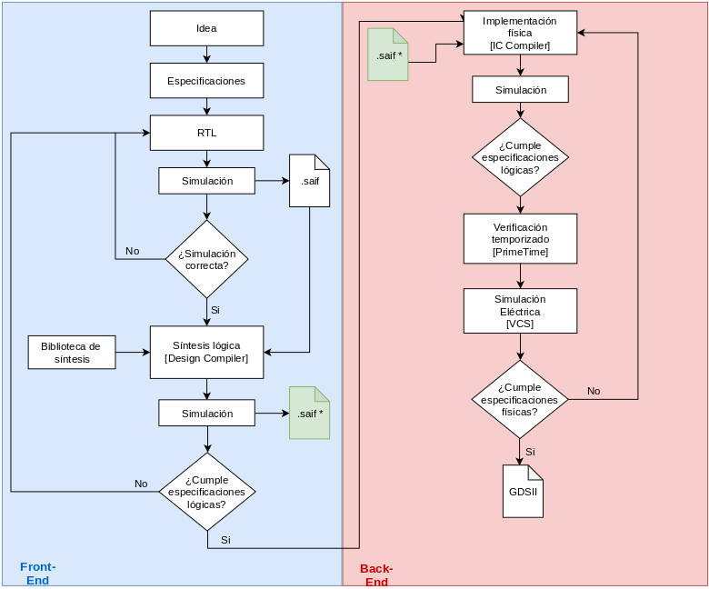

# Flujo para la Generanción de un SoC con las herramientas y Bibliotecas de Synopsys.
## Introducción
En el presente git se pretende enseñar y proveer los scripts necesarios para tormar un diseño en RTL y llevarlo hasta su sintesís física utilizando las bibliotecas de 180 nm de Synopsys.  Se proveé a modo de ejemplo el código RTL de una ALU a la cual se le aplicara todos los procesos necesarios para converger su síntesis física.  

## Flujo
El flujo inicia usando como entrada el código verilog que describe el RTL. Inicialmente se verifica su funcionamiento y luego se corre una simulación especial para extraer un archivo saif. Estos tipos de archivos contienen la información de switching para hacer una estimación de potencia de un diseño bajo las condiciones expuestas en la simulación. Ambos archivos (RTL y saif) se utilizan en la herramienta **Design Compiler** para ejecutar la síntesis y obtener un archivo verilog a nivel de compuertas con una primera estimación de consumo. Para la síntesis física se corre un proceso similar con la diferencia que se utiliza como entrada el verilog a nivel de compuertas y el archivo saif de su simulación. Al final de todo este flujo se quiere obtener un archivo GDSII que utiliza el fabricante para la construcción del chip. El flujo utilizado se muestra en la próxima imagen.

  

## Jerarquía de Carpetas
Con el fin de mantener todos los archivos ordenados y una localización estandarizada para los scripts se utiliza la siguiente jerarquía de carpetas:

* **Front_end:**
* **Back_end:**
* **Prime_time**
* 

  

